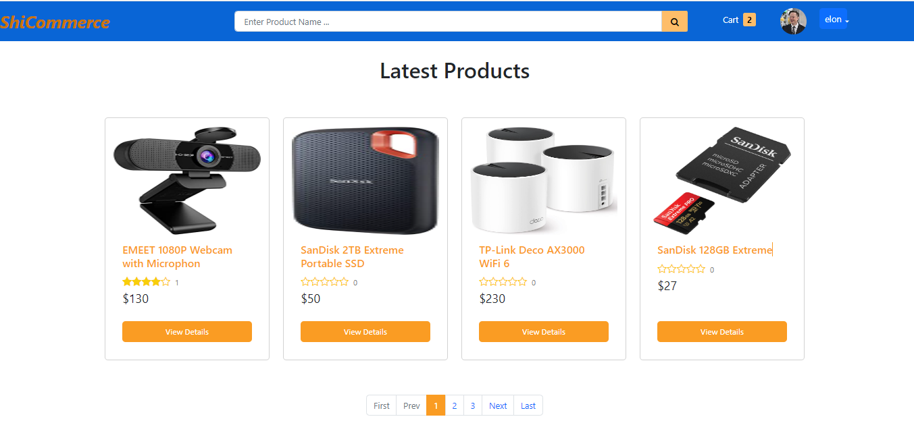
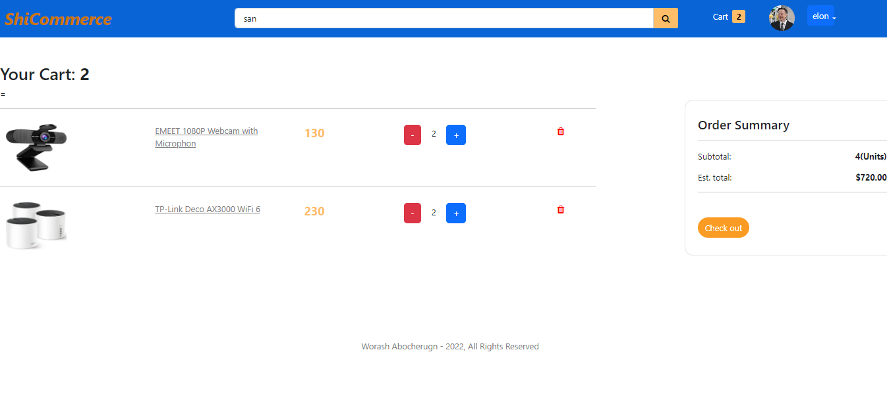
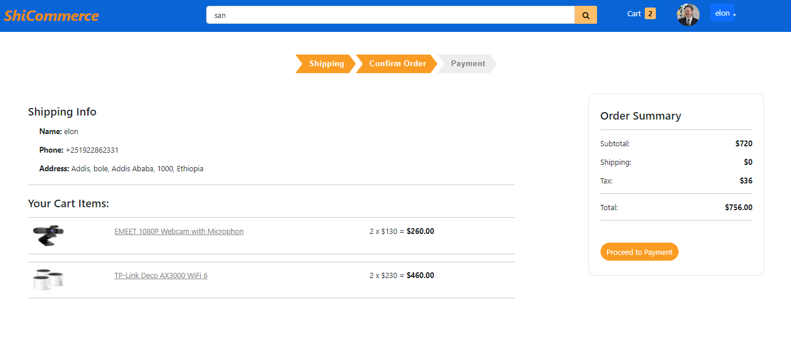
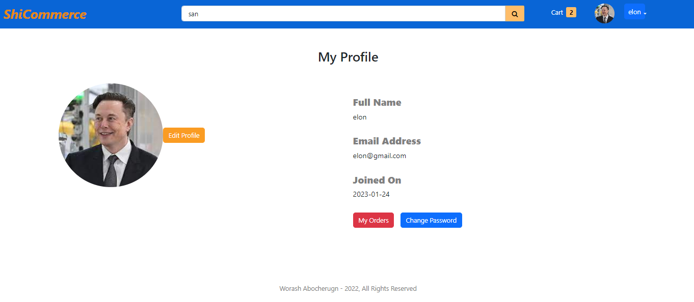
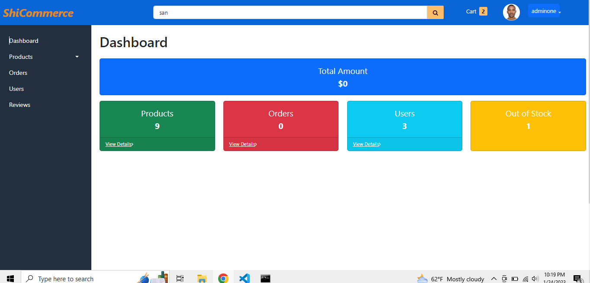

# ShiCommerce

> ShiCommerce is an e-commerce website developed to learn NodeJS, ExpressJS, MongoDB, ReactJS and Redux.  ShiCommerce has  features for admin and users(buyer).
 Admin can manage products, manage orders, manage product reviews and users. User(buyer) can check product details, add product to cart, checkout the cart,  fill shipping address, and pay payment using Stripe. and also user can check order status(processing, shipping and delivered).

## Built With

- NodeJS
- ExpressJS
- MongoDB =>(Mongoose)
- ReactJS
- Redux
- Bootstrap

## Other tools
 - Cloudinary 
 - Stripe

  

# 1. User pages 
## 1.1 Home page product listing 

##  1.2 Search and filter products page

## 1.3  Cart page 

##  1.4 Checkout page 

## 1.5 Payment page

## 1.6  User profile page

# 2. Admin page
## 2.1 Dashboard page

## 2.2 Products listing page

## 2.3  Add new product page

## Getting Started

To get the copy of this project in your computer,clone this repository or just download it.

### Prerequisites

- Code editor like vs code
- node js installed

### Setup

- Download or clone the repository
- Open the folder in your IDE
- Install the dependencies =>"npm install"  in root folder 
-  Run "npm run dev" to run the backend
- Under frontend folder run  "npm start" to run the front end
- Use  email=  "admin@gmail.com" and password = 1234567  for admin
- Signup for normal user

## Authors

👤 **Worash**

- GitHub: [@Worashf](https://github.com/worashf)
- Twitter: [@WorashAboche](https://twitter.com/WorashAboche)
- LinkedIn: [Worash Abocherugn](https://www.linkedin.com/in/worash-abocherugn-a02219154/)

## 🤝 Contributing

Contributions, issues, and feature requests are welcome!

Feel free to check the [issues page](../../issues/).

## Show your support

Give a ⭐️ if you like this project!

## Acknowledgments

- Hat tip to anyone whose code was used
- Inspiration

## 📝 License

This project is [MIT](./MIT.md) licensed.
